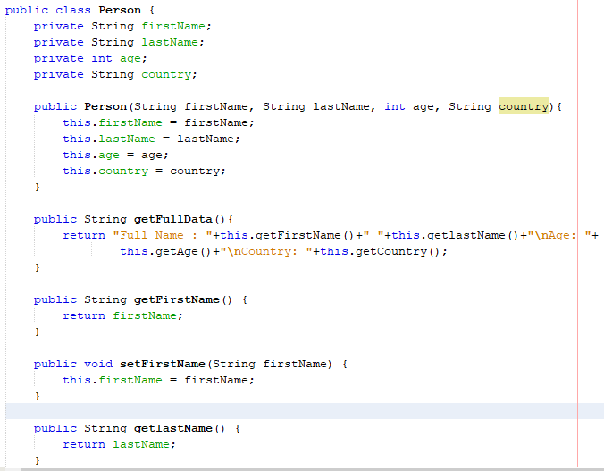
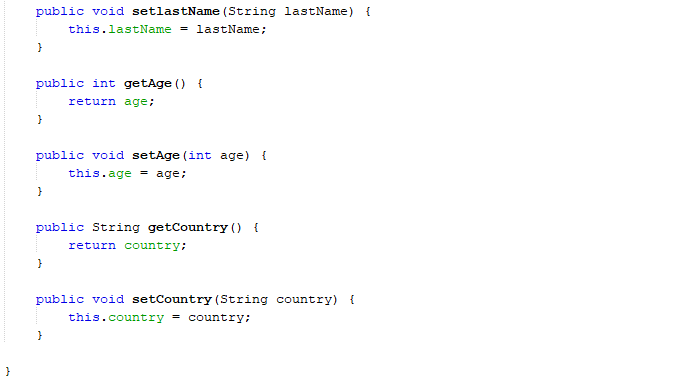
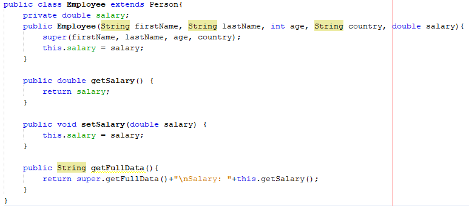

# Inheritance

In Java language, a class can de derived from another class, that means it can inherit fields and methods from that class.

Here we have some short but important definitions:
- Subclass  
    It's the class that is derived from another class, also known as *derived class, extended class or child class*.
- Superclass    
    It's the class from the subclass is derived, also known as *base class oe parent class*.

A class only have one direct superclass except *Object* class, which doesn't have it.

**So, What does inheritance mean?**     
Inheritance in Java allows us to create a class derived from existing class and doing this we can reuse fields and methods from the existing one.

A subclass inherits fields, methods and nested classes from its superclass except a constructor but the superclass constructor can be invoked from the subclass.

## Subclass
A subclass inherits all the protected and public members of its parent.    

**Note:**       
A subclass does not inherit the private members of its parent class. However, if the superclass has public or protected methods for accessing its private fields, these can also be used by the subclass. (The Java Tutorial)

Example:    
- This is the Person Class.
    
    
- This is Employee Class derived from Person Class.
    

## Casting with objects.

